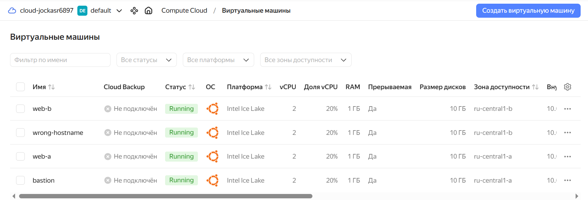
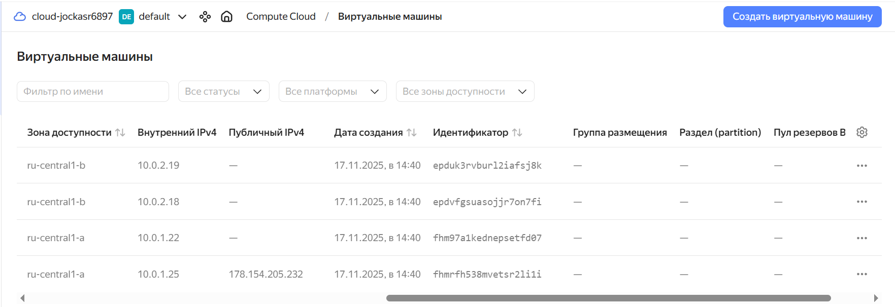
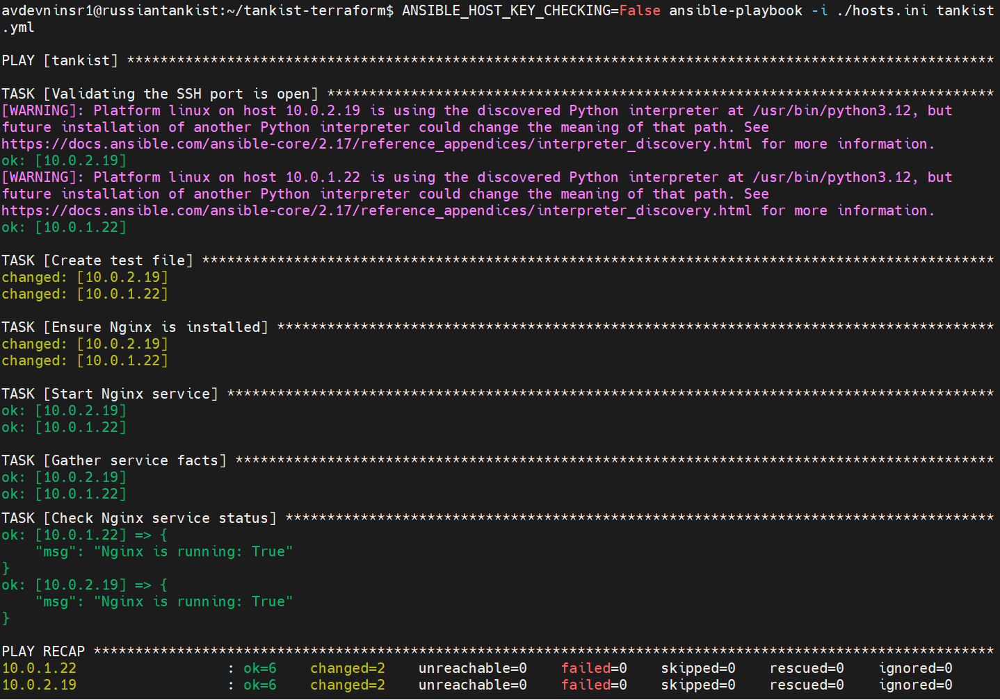
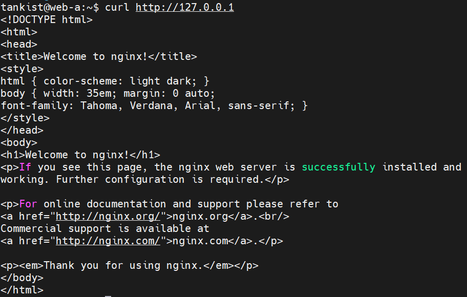
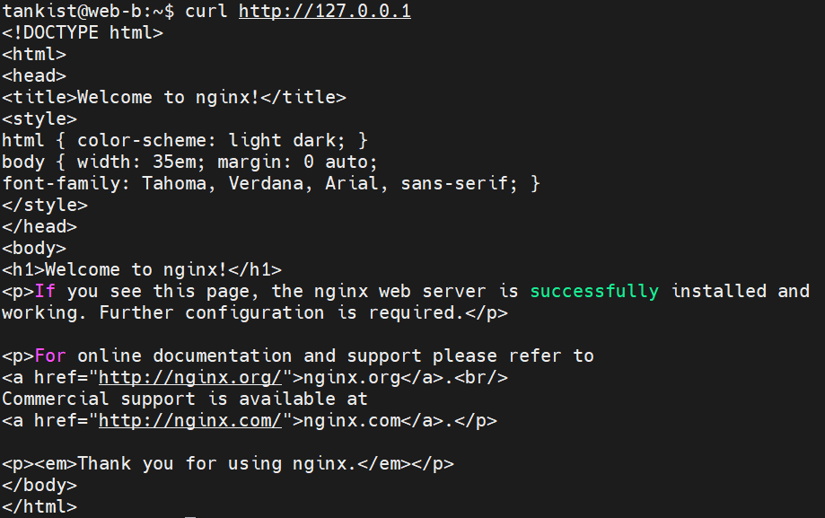

# The_rise_of_infrastructure_in_the_cloud-my-netology-hw
### Задание 1 
1. Устанавливаем провайдер

```
avdevninsr1@russiantankist:~/tankist-terraform$ terraform init
```
```
Initializing the backend...
Initializing provider plugins...
- Finding yandex-cloud/yandex versions matching "0.129.0"...
- Finding latest version of hashicorp/local...
- Installing hashicorp/local v2.5.3...
- Installed hashicorp/local v2.5.3 (unauthenticated)
- Installing yandex-cloud/yandex v0.129.0...
- Installed yandex-cloud/yandex v0.129.0 (unauthenticated)
Terraform has created a lock file .terraform.lock.hcl to record the provider
selections it made above. Include this file in your version control repository
so that Terraform can guarantee to make the same selections by default when
you run "terraform init" in the future.
```
```
Terraform has been successfully initialized!

You may now begin working with Terraform. Try running "terraform plan" to see
any changes that are required for your infrastructure. All Terraform commands
should now work.

If you ever set or change modules or backend configuration for Terraform,
rerun this command to reinitialize your working directory. If you forget, other
commands will detect it and remind you to do so if necessary.
```
2. Создаём конфигурацию в плане
```
avdevninsr1@russiantankist:~/tankist-terraform$ terraform plan -out=plan
```
```
data.yandex_compute_image.ubuntu_2204_lts: Reading...
data.yandex_compute_image.ubuntu_2204_lts: Read complete after 1s [id=fd8clal01mnr2lnop5vr]

Terraform used the selected providers to generate the following execution plan. Resource actions are indicated with
the following symbols:
  + create

Terraform will perform the following actions:

  # local_file.inventory will be created
  + resource "local_file" "inventory" {
      + content              = (known after apply)
      + content_base64sha256 = (known after apply)
      + content_base64sha512 = (known after apply)
      + content_md5          = (known after apply)
      + content_sha1         = (known after apply)
      + content_sha256       = (known after apply)
      + content_sha512       = (known after apply)
      + directory_permission = "0777"
      + file_permission      = "0777"
      + filename             = "./hosts.ini"
      + id                   = (known after apply)
    }

  # yandex_compute_instance.bastion will be created
  + resource "yandex_compute_instance" "bastion" {
      + created_at                = (known after apply)
      + folder_id                 = (known after apply)
      + fqdn                      = (known after apply)
      + gpu_cluster_id            = (known after apply)
      + hostname                  = "bastion"
      + id                        = (known after apply)
      + maintenance_grace_period  = (known after apply)
      + maintenance_policy        = (known after apply)
      + metadata                  = {
          + "serial-port-enable" = "1"
          + "user-data"          = <<-EOT
                #cloud-config
                users:
                  - name: tankist
                    groups: sudo
                    shell: /bin/bash
                    sudo: ["ALL=(ALL) NOPASSWD:ALL"]
                    ssh_authorized_keys:
                      - ssh-rsa AAAAB3NzaC1yc2EAAAADAQABAAABgQCkE3I5XU5chpw2dQn1vMV5HohPabyT+Iv50QDqUwj6mJMHRAwK6/qCzLnmiRvzIBOr3oGh3YFknXhVEkw3HceVPWV3I6MfMyk+NK30CLNX4xh0BGBkyQ9lbLqtsEBS723gwKoDAcN0bgqTkKBhB3+MXhcRJiNzEv8rZKVru/ZZiS76bCEFJNjlEVqYQQDv16DPxLu8eZeiNljArZM+0VjAFR3GBaqWP9EuN1JoHg8uBJtmaVFSHRq0jGDSkahrRhGsx3JBPIxzE5aU/iMf7jWynRUi4yQaWmEQ079a1ufVgxFTYSk6eN20humfCVxpHbeAMdVAFxpQdW/bnta2UlqjCK2QymydpYhW2w0vrh8hNdPdpWyw1Nd5nsicmzZRsa0jPOKqid/AOUHCCtoln4jj4OKtJ3vGInpBaLp1O1XXZynj4iZJbHJg9p5iGXeKJ9k+Yl9fKWgDzICO+VIsxJsx+zAsfVS9EWBvwVYfZhlBgOA8YyAF3UBgmxTqV869q8E= avdevninsr1@russiantankist
            EOT
        }
      + name                      = "bastion"
      + network_acceleration_type = "standard"
      + platform_id               = "standard-v3"
      + service_account_id        = (known after apply)
      + status                    = (known after apply)
      + zone                      = "ru-central1-a"

      + boot_disk {
          + auto_delete = true
          + device_name = (known after apply)
          + disk_id     = (known after apply)
          + mode        = (known after apply)

          + initialize_params {
              + block_size  = (known after apply)
              + description = (known after apply)
              + image_id    = "fd8clal01mnr2lnop5vr"
              + name        = (known after apply)
              + size        = 10
              + snapshot_id = (known after apply)
              + type        = "network-hdd"
            }
        }

      + metadata_options (known after apply)

      + network_interface {
          + index              = (known after apply)
          + ip_address         = (known after apply)
          + ipv4               = true
          + ipv6               = (known after apply)
          + ipv6_address       = (known after apply)
          + mac_address        = (known after apply)
          + nat                = true
          + nat_ip_address     = (known after apply)
          + nat_ip_version     = (known after apply)
          + security_group_ids = (known after apply)
          + subnet_id          = (known after apply)
        }

      + placement_policy (known after apply)

      + resources {
          + core_fraction = 20
          + cores         = 2
          + memory        = 1
        }

      + scheduling_policy {
          + preemptible = true
        }
    }

  # yandex_compute_instance.web_a will be created
  + resource "yandex_compute_instance" "web_a" {
      + created_at                = (known after apply)
      + folder_id                 = (known after apply)
      + fqdn                      = (known after apply)
      + gpu_cluster_id            = (known after apply)
      + hostname                  = "web-a"
      + id                        = (known after apply)
      + maintenance_grace_period  = (known after apply)
      + maintenance_policy        = (known after apply)
      + metadata                  = {
          + "serial-port-enable" = "1"
          + "user-data"          = <<-EOT
                #cloud-config
                users:
                  - name: tankist
                    groups: sudo
                    shell: /bin/bash
                    sudo: ["ALL=(ALL) NOPASSWD:ALL"]
                    ssh_authorized_keys:
                      - ssh-rsa AAAAB3NzaC1yc2EAAAADAQABAAABgQCkE3I5XU5chpw2dQn1vMV5HohPabyT+Iv50QDqUwj6mJMHRAwK6/qCzLnmiRvzIBOr3oGh3YFknXhVEkw3HceVPWV3I6MfMyk+NK30CLNX4xh0BGBkyQ9lbLqtsEBS723gwKoDAcN0bgqTkKBhB3+MXhcRJiNzEv8rZKVru/ZZiS76bCEFJNjlEVqYQQDv16DPxLu8eZeiNljArZM+0VjAFR3GBaqWP9EuN1JoHg8uBJtmaVFSHRq0jGDSkahrRhGsx3JBPIxzE5aU/iMf7jWynRUi4yQaWmEQ079a1ufVgxFTYSk6eN20humfCVxpHbeAMdVAFxpQdW/bnta2UlqjCK2QymydpYhW2w0vrh8hNdPdpWyw1Nd5nsicmzZRsa0jPOKqid/AOUHCCtoln4jj4OKtJ3vGInpBaLp1O1XXZynj4iZJbHJg9p5iGXeKJ9k+Yl9fKWgDzICO+VIsxJsx+zAsfVS9EWBvwVYfZhlBgOA8YyAF3UBgmxTqV869q8E= avdevninsr1@russiantankist
            EOT
        }
      + name                      = "web-a"
      + network_acceleration_type = "standard"
      + platform_id               = "standard-v3"
      + service_account_id        = (known after apply)
      + status                    = (known after apply)
      + zone                      = "ru-central1-a"

      + boot_disk {
          + auto_delete = true
          + device_name = (known after apply)
          + disk_id     = (known after apply)
          + mode        = (known after apply)

          + initialize_params {
              + block_size  = (known after apply)
              + description = (known after apply)
              + image_id    = "fd8clal01mnr2lnop5vr"
              + name        = (known after apply)
              + size        = 10
              + snapshot_id = (known after apply)
              + type        = "network-hdd"
            }
        }

      + metadata_options (known after apply)

      + network_interface {
          + index              = (known after apply)
          + ip_address         = (known after apply)
          + ipv4               = true
          + ipv6               = (known after apply)
          + ipv6_address       = (known after apply)
          + mac_address        = (known after apply)
          + nat                = false
          + nat_ip_address     = (known after apply)
          + nat_ip_version     = (known after apply)
          + security_group_ids = (known after apply)
          + subnet_id          = (known after apply)
        }

      + placement_policy (known after apply)

      + resources {
          + core_fraction = 20
          + cores         = 2
          + memory        = 1
        }

      + scheduling_policy {
          + preemptible = true
        }
    }

  # yandex_compute_instance.web_b will be created
  + resource "yandex_compute_instance" "web_b" {
      + created_at                = (known after apply)
      + folder_id                 = (known after apply)
      + fqdn                      = (known after apply)
      + gpu_cluster_id            = (known after apply)
      + hostname                  = "web-b"
      + id                        = (known after apply)
      + maintenance_grace_period  = (known after apply)
      + maintenance_policy        = (known after apply)
      + metadata                  = {
          + "serial-port-enable" = "1"
          + "user-data"          = <<-EOT
                #cloud-config
                users:
                  - name: tankist
                    groups: sudo
                    shell: /bin/bash
                    sudo: ["ALL=(ALL) NOPASSWD:ALL"]
                    ssh_authorized_keys:
                      - ssh-rsa AAAAB3NzaC1yc2EAAAADAQABAAABgQCkE3I5XU5chpw2dQn1vMV5HohPabyT+Iv50QDqUwj6mJMHRAwK6/qCzLnmiRvzIBOr3oGh3YFknXhVEkw3HceVPWV3I6MfMyk+NK30CLNX4xh0BGBkyQ9lbLqtsEBS723gwKoDAcN0bgqTkKBhB3+MXhcRJiNzEv8rZKVru/ZZiS76bCEFJNjlEVqYQQDv16DPxLu8eZeiNljArZM+0VjAFR3GBaqWP9EuN1JoHg8uBJtmaVFSHRq0jGDSkahrRhGsx3JBPIxzE5aU/iMf7jWynRUi4yQaWmEQ079a1ufVgxFTYSk6eN20humfCVxpHbeAMdVAFxpQdW/bnta2UlqjCK2QymydpYhW2w0vrh8hNdPdpWyw1Nd5nsicmzZRsa0jPOKqid/AOUHCCtoln4jj4OKtJ3vGInpBaLp1O1XXZynj4iZJbHJg9p5iGXeKJ9k+Yl9fKWgDzICO+VIsxJsx+zAsfVS9EWBvwVYfZhlBgOA8YyAF3UBgmxTqV869q8E= avdevninsr1@russiantankist
            EOT
        }
      + name                      = "web-b"
      + network_acceleration_type = "standard"
      + platform_id               = "standard-v3"
      + service_account_id        = (known after apply)
      + status                    = (known after apply)
      + zone                      = "ru-central1-b"

      + boot_disk {
          + auto_delete = true
          + device_name = (known after apply)
          + disk_id     = (known after apply)
          + mode        = (known after apply)

          + initialize_params {
              + block_size  = (known after apply)
              + description = (known after apply)
              + image_id    = "fd8clal01mnr2lnop5vr"
              + name        = (known after apply)
              + size        = 10
              + snapshot_id = (known after apply)
              + type        = "network-hdd"
            }
        }

      + metadata_options (known after apply)

      + network_interface {
          + index              = (known after apply)
          + ip_address         = (known after apply)
          + ipv4               = true
          + ipv6               = (known after apply)
          + ipv6_address       = (known after apply)
          + mac_address        = (known after apply)
          + nat                = false
          + nat_ip_address     = (known after apply)
          + nat_ip_version     = (known after apply)
          + security_group_ids = (known after apply)
          + subnet_id          = (known after apply)
        }

      + placement_policy (known after apply)

      + resources {
          + core_fraction = 20
          + cores         = 2
          + memory        = 1
        }

      + scheduling_policy {
          + preemptible = true
        }
    }

  # yandex_compute_instance.wrong_b will be created
  + resource "yandex_compute_instance" "wrong_b" {
      + created_at                = (known after apply)
      + folder_id                 = (known after apply)
      + fqdn                      = (known after apply)
      + gpu_cluster_id            = (known after apply)
      + hostname                  = (known after apply)
      + id                        = (known after apply)
      + maintenance_grace_period  = (known after apply)
      + maintenance_policy        = (known after apply)
      + metadata                  = {
          + "serial-port-enable" = "1"
          + "user-data"          = <<-EOT
                #cloud-config
                users:
                  - name: tankist
                    groups: sudo
                    shell: /bin/bash
                    sudo: ["ALL=(ALL) NOPASSWD:ALL"]
                    ssh_authorized_keys:
                      - ssh-rsa AAAAB3NzaC1yc2EAAAADAQABAAABgQCkE3I5XU5chpw2dQn1vMV5HohPabyT+Iv50QDqUwj6mJMHRAwK6/qCzLnmiRvzIBOr3oGh3YFknXhVEkw3HceVPWV3I6MfMyk+NK30CLNX4xh0BGBkyQ9lbLqtsEBS723gwKoDAcN0bgqTkKBhB3+MXhcRJiNzEv8rZKVru/ZZiS76bCEFJNjlEVqYQQDv16DPxLu8eZeiNljArZM+0VjAFR3GBaqWP9EuN1JoHg8uBJtmaVFSHRq0jGDSkahrRhGsx3JBPIxzE5aU/iMf7jWynRUi4yQaWmEQ079a1ufVgxFTYSk6eN20humfCVxpHbeAMdVAFxpQdW/bnta2UlqjCK2QymydpYhW2w0vrh8hNdPdpWyw1Nd5nsicmzZRsa0jPOKqid/AOUHCCtoln4jj4OKtJ3vGInpBaLp1O1XXZynj4iZJbHJg9p5iGXeKJ9k+Yl9fKWgDzICO+VIsxJsx+zAsfVS9EWBvwVYfZhlBgOA8YyAF3UBgmxTqV869q8E= avdevninsr1@russiantankist
            EOT
        }
      + name                      = "wrong-hostname"
      + network_acceleration_type = "standard"
      + platform_id               = "standard-v3"
      + service_account_id        = (known after apply)
      + status                    = (known after apply)
      + zone                      = "ru-central1-b"

      + boot_disk {
          + auto_delete = true
          + device_name = (known after apply)
          + disk_id     = (known after apply)
          + mode        = (known after apply)

          + initialize_params {
              + block_size  = (known after apply)
              + description = (known after apply)
              + image_id    = "fd8clal01mnr2lnop5vr"
              + name        = (known after apply)
              + size        = 10
              + snapshot_id = (known after apply)
              + type        = "network-hdd"
            }
        }

      + metadata_options (known after apply)

      + network_interface {
          + index              = (known after apply)
          + ip_address         = (known after apply)
          + ipv4               = true
          + ipv6               = (known after apply)
          + ipv6_address       = (known after apply)
          + mac_address        = (known after apply)
          + nat                = false
          + nat_ip_address     = (known after apply)
          + nat_ip_version     = (known after apply)
          + security_group_ids = (known after apply)
          + subnet_id          = (known after apply)
        }

      + placement_policy (known after apply)

      + resources {
          + core_fraction = 20
          + cores         = 2
          + memory        = 1
        }

      + scheduling_policy {
          + preemptible = true
        }
    }

  # yandex_vpc_gateway.nat_gateway will be created
  + resource "yandex_vpc_gateway" "nat_gateway" {
      + created_at = (known after apply)
      + folder_id  = (known after apply)
      + id         = (known after apply)
      + labels     = (known after apply)
      + name       = "fops-gateway-24-01"

      + shared_egress_gateway {}
    }

  # yandex_vpc_network.develop will be created
  + resource "yandex_vpc_network" "develop" {
      + created_at                = (known after apply)
      + default_security_group_id = (known after apply)
      + folder_id                 = (known after apply)
      + id                        = (known after apply)
      + labels                    = (known after apply)
      + name                      = "develop-fops-24-01"
      + subnet_ids                = (known after apply)
    }

  # yandex_vpc_route_table.rt will be created
  + resource "yandex_vpc_route_table" "rt" {
      + created_at = (known after apply)
      + folder_id  = (known after apply)
      + id         = (known after apply)
      + labels     = (known after apply)
      + name       = "fops-route-table-24-01"
      + network_id = (known after apply)

      + static_route {
          + destination_prefix = "0.0.0.0/0"
          + gateway_id         = (known after apply)
            # (1 unchanged attribute hidden)
        }
    }

  # yandex_vpc_security_group.LAN will be created
  + resource "yandex_vpc_security_group" "LAN" {
      + created_at = (known after apply)
      + folder_id  = (known after apply)
      + id         = (known after apply)
      + labels     = (known after apply)
      + name       = "LAN-sg-24-01"
      + network_id = (known after apply)
      + status     = (known after apply)

      + egress {
          + description       = "Permit ANY"
          + from_port         = 0
          + id                = (known after apply)
          + labels            = (known after apply)
          + port              = -1
          + protocol          = "ANY"
          + to_port           = 65535
          + v4_cidr_blocks    = [
              + "0.0.0.0/0",
            ]
          + v6_cidr_blocks    = []
            # (2 unchanged attributes hidden)
        }

      + ingress {
          + description       = "Allow 10.0.0.0/8"
          + from_port         = 0
          + id                = (known after apply)
          + labels            = (known after apply)
          + port              = -1
          + protocol          = "ANY"
          + to_port           = 65535
          + v4_cidr_blocks    = [
              + "10.0.0.0/8",
            ]
          + v6_cidr_blocks    = []
            # (2 unchanged attributes hidden)
        }
    }

  # yandex_vpc_security_group.bastion will be created
  + resource "yandex_vpc_security_group" "bastion" {
      + created_at = (known after apply)
      + folder_id  = (known after apply)
      + id         = (known after apply)
      + labels     = (known after apply)
      + name       = "bastion-sg-24-01"
      + network_id = (known after apply)
      + status     = (known after apply)

      + egress {
          + description       = "Permit ANY"
          + from_port         = 0
          + id                = (known after apply)
          + labels            = (known after apply)
          + port              = -1
          + protocol          = "ANY"
          + to_port           = 65535
          + v4_cidr_blocks    = [
              + "0.0.0.0/0",
            ]
          + v6_cidr_blocks    = []
            # (2 unchanged attributes hidden)
        }

      + ingress {
          + description       = "Allow 0.0.0.0/0"
          + from_port         = -1
          + id                = (known after apply)
          + labels            = (known after apply)
          + port              = 22
          + protocol          = "TCP"
          + to_port           = -1
          + v4_cidr_blocks    = [
              + "0.0.0.0/0",
            ]
          + v6_cidr_blocks    = []
            # (2 unchanged attributes hidden)
        }
    }

  # yandex_vpc_security_group.web_sg will be created
  + resource "yandex_vpc_security_group" "web_sg" {
      + created_at = (known after apply)
      + folder_id  = (known after apply)
      + id         = (known after apply)
      + labels     = (known after apply)
      + name       = "web-sg-24-01"
      + network_id = (known after apply)
      + status     = (known after apply)

      + egress (known after apply)

      + ingress {
          + description       = "Allow HTTP"
          + from_port         = -1
          + id                = (known after apply)
          + labels            = (known after apply)
          + port              = 80
          + protocol          = "TCP"
          + to_port           = -1
          + v4_cidr_blocks    = [
              + "0.0.0.0/0",
            ]
          + v6_cidr_blocks    = []
            # (2 unchanged attributes hidden)
        }
      + ingress {
          + description       = "Allow HTTPS"
          + from_port         = -1
          + id                = (known after apply)
          + labels            = (known after apply)
          + port              = 443
          + protocol          = "TCP"
          + to_port           = -1
          + v4_cidr_blocks    = [
              + "0.0.0.0/0",
            ]
          + v6_cidr_blocks    = []
            # (2 unchanged attributes hidden)
        }
    }

  # yandex_vpc_subnet.develop_a will be created
  + resource "yandex_vpc_subnet" "develop_a" {
      + created_at     = (known after apply)
      + folder_id      = (known after apply)
      + id             = (known after apply)
      + labels         = (known after apply)
      + name           = "develop-fops-24-01-ru-central1-a"
      + network_id     = (known after apply)
      + route_table_id = (known after apply)
      + v4_cidr_blocks = [
          + "10.0.1.0/24",
        ]
      + v6_cidr_blocks = (known after apply)
      + zone           = "ru-central1-a"
    }

  # yandex_vpc_subnet.develop_b will be created
  + resource "yandex_vpc_subnet" "develop_b" {
      + created_at     = (known after apply)
      + folder_id      = (known after apply)
      + id             = (known after apply)
      + labels         = (known after apply)
      + name           = "develop-fops-24-01-ru-central1-b"
      + network_id     = (known after apply)
      + route_table_id = (known after apply)
      + v4_cidr_blocks = [
          + "10.0.2.0/24",
        ]
      + v6_cidr_blocks = (known after apply)
      + zone           = "ru-central1-b"
    }

Plan: 13 to add, 0 to change, 0 to destroy.
```
3. Применяем конфигурацию командой apply
```
avdevninsr1@russiantankist:~/tankist-terraform$ terraform apply plan
```
```
yandex_vpc_network.develop: Creating...
yandex_vpc_gateway.nat_gateway: Creating...
yandex_vpc_gateway.nat_gateway: Creation complete after 1s [id=enpkq1gd3268995bc8mc]
yandex_vpc_network.develop: Creation complete after 7s [id=enpguiteosq3afnas87f]
yandex_vpc_security_group.web_sg: Creating...
yandex_vpc_security_group.bastion: Creating...
yandex_vpc_route_table.rt: Creating...
yandex_vpc_security_group.LAN: Creating...
yandex_vpc_route_table.rt: Creation complete after 2s [id=enpi9i4mlmkjlt8g7aj3]
yandex_vpc_subnet.develop_a: Creating...
yandex_vpc_subnet.develop_b: Creating...
yandex_vpc_subnet.develop_a: Creation complete after 0s [id=e9bb3is03f8uha4a7qta]
yandex_vpc_subnet.develop_b: Creation complete after 1s [id=e2ls57lkj3queluco2vd]
yandex_vpc_security_group.bastion: Creation complete after 3s [id=enpi00p8b8ai5nauc2db]
yandex_vpc_security_group.web_sg: Creation complete after 6s [id=enp1fnfpup4f5mqm7orm]
yandex_vpc_security_group.LAN: Still creating... [00m10s elapsed]
yandex_vpc_security_group.LAN: Creation complete after 19s [id=enpoe57lhptic18jtlac]
yandex_compute_instance.bastion: Creating...
yandex_compute_instance.web_a: Creating...
yandex_compute_instance.wrong_b: Creating...
yandex_compute_instance.web_b: Creating...
yandex_compute_instance.wrong_b: Still creating... [00m10s elapsed]
yandex_compute_instance.bastion: Still creating... [00m10s elapsed]
yandex_compute_instance.web_a: Still creating... [00m10s elapsed]
yandex_compute_instance.web_b: Still creating... [00m10s elapsed]
yandex_compute_instance.web_a: Still creating... [00m20s elapsed]
yandex_compute_instance.wrong_b: Still creating... [00m20s elapsed]
yandex_compute_instance.bastion: Still creating... [00m20s elapsed]
yandex_compute_instance.web_b: Still creating... [00m20s elapsed]
yandex_compute_instance.bastion: Still creating... [00m30s elapsed]
yandex_compute_instance.web_a: Still creating... [00m30s elapsed]
yandex_compute_instance.wrong_b: Still creating... [00m30s elapsed]
yandex_compute_instance.web_b: Still creating... [00m30s elapsed]
yandex_compute_instance.wrong_b: Creation complete after 36s [id=epdvfgsuasojjr7on7fi]
yandex_compute_instance.web_a: Still creating... [00m40s elapsed]
yandex_compute_instance.bastion: Still creating... [00m40s elapsed]
yandex_compute_instance.web_b: Still creating... [00m40s elapsed]
yandex_compute_instance.web_b: Creation complete after 49s [id=epduk3rvburl2iafsj8k]
yandex_compute_instance.bastion: Creation complete after 49s [id=fhmrfh538mvetsr2li1i]
yandex_compute_instance.web_a: Creation complete after 50s [id=fhm97a1kednepsetfd07]
local_file.inventory: Creating...
local_file.inventory: Creation complete after 0s [id=6e2fb2cf708913b888a13dc441ecc3eab06f509b]

Apply complete! Resources: 13 added, 0 changed, 0 destroyed.
```
4. Развёрнутые виртуальные машины

</br>
### Задание 2

1. IP адреса развёрнутых в облаке ВМ

</br>

2. Демонстрация выполнения плейбука

</br>

3. Демонстрация установленного Nginx

</br>

</br>